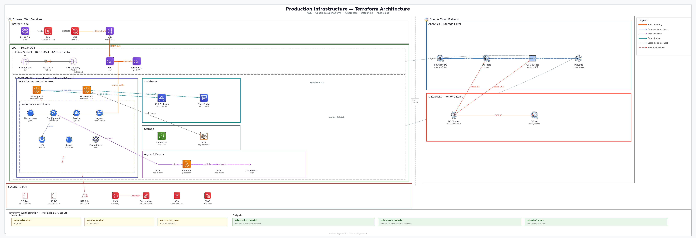

# tf-diagram — Terraform → Architecture Diagram skill

Generate professional, enterprise-grade architecture diagrams from any Terraform project. Produces an editable `.drawio` file (multi-page, one per region/account + Legend) and a PNG preview with **official** AWS, GCP, Azure, Kubernetes, Helm and Databricks icons.

  



> _Example generated output: AWS VPC + EKS, GCP analytics, Databricks Unity Catalog, plus security and compliance overlays — all derived from `.tf` files._

## Features

- Parses entire Terraform project recursively (`.tf` / `.hcl`)
- Detects resources, modules, variables, outputs, data sources, providers
- Multi-cloud: **AWS · GCP · Azure · Kubernetes · Helm · Databricks**
- Terragrunt multi-account aware (auto page split by account/region)
- Compliance badges for resources missing `tags` / `labels`
- Implicit + explicit (`depends_on`) dependency arrows
- Company-grade style: white zones, thin borders, orthogonal routing

## Install

### Option A — Claude Code plugin (recommended)

```bash
# Inside Claude Code
/plugin marketplace add anllacarpro/tf-diagram-skill
/plugin install tf-diagram@tf-diagram-marketplace
```

### Option B — Manual skill install

```bash
git clone https://github.com/anllacarpro/tf-diagram-skill.git ~/.claude/skills/tf-diagram
pip install python-hcl2 matplotlib
python3 ~/.claude/skills/tf-diagram/scripts/download_icons.py
```

### Option C — Standalone CLI (no Claude Code)

```bash
git clone https://github.com/anllacarpro/tf-diagram-skill.git
cd tf-diagram-skill
pip install python-hcl2 matplotlib
python3 scripts/download_icons.py
python3 scripts/tf_to_diagram.py <terraform_dir> --output arch.drawio --png arch.png --verbose
```

## Usage from Claude Code

Ask Claude in natural language — the skill auto-triggers on phrases like:

- `grafica mi terraform`
- `diagram my infrastructure at ~/myproject`
- `generate architecture diagram for ./infra`
- `tf diagram`, `map my terraform`, `visualiza infraestructura`

## Output

- **`<name>.drawio`** — Multi-page editable diagram (open in https://app.diagrams.net or VS Code Draw.io extension)
- **`<name>.png`** — Preview image with official cloud icons

## Requirements

- Python 3.10+
- `python-hcl2`, `matplotlib`
- Internet access for the one-time icon download (~34 MB)

## Contributing

PRs welcome. See [`SKILL.md`](./SKILL.md) for skill internals and [`references/`](./references/) for the icon map and provider mapping.

## License

[MIT](./LICENSE) © Miguel Alarcon
